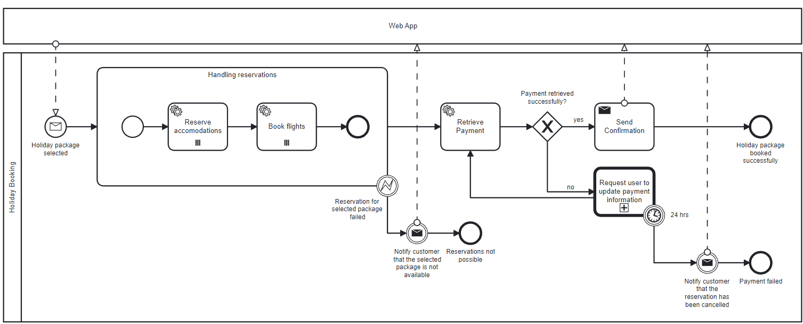

# Microservice Architecture Playground
This repository features exemplary microservice architectures which orchestrate SpringBoot services.
For this example this repository is going to be focussed on the use-case of booking a vacation. 
Besides of our SpringBoot services other infrastructure components such as Kafka and Camunda will be used. 

## Holiday Booking 
As mentioned, this repository is focussed on architecting and implementing a system which should allow users to 
book a vacation. Let's start by modelling a process using the BPMN standard to visualise different domain services 
needed in order to accomplish the task. 

The user can select a holiday package. Having done so we first of all try to reserve accommodations as well as flights. 
If one of this fails we are going to notify the customer about it and end our process here. 

If everything was successful we continue and retrieve the payment from the data the customer provided in the first place.
In case this step is not successful we are going to request an update on the payment information. If this does not happen if 
24 hours we are going to cancel the reservation and inform the customer about it. 

When the payment succeeds we are going to notify the customer about his successfully booked vacation. 

## Trying out different architectures 
To try out different architecture styles this repository expands into further folders. Each of them shows one possible 
approach on how to tackle such a business problem. 

* [Layered Software Architecture](./layered-sw-architecture)
* [Choreographed Architecture](./choreographed-sw-architecture) 
* [Orchestrated Architecture](./orchestrated-sw-architecture) 
* [Orchestrated and Choreographed Architecture](./orchestrated-choreographed-sw-architecture)
